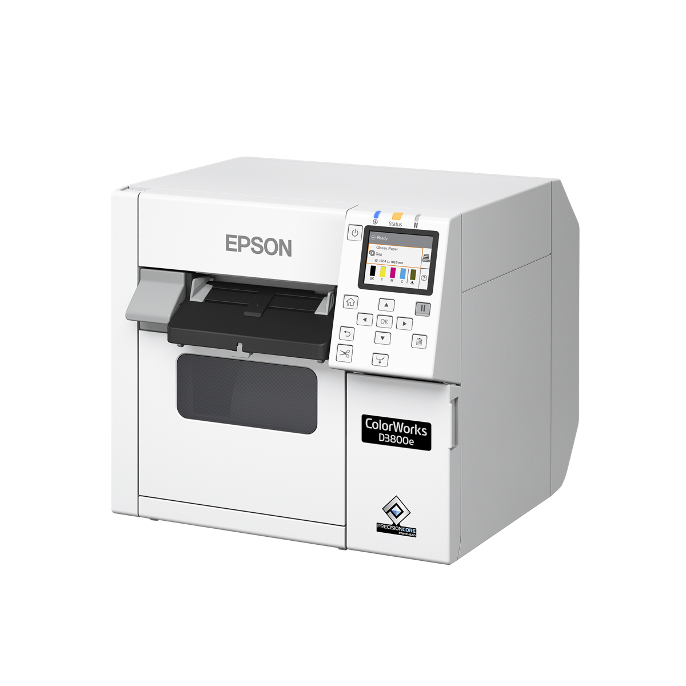
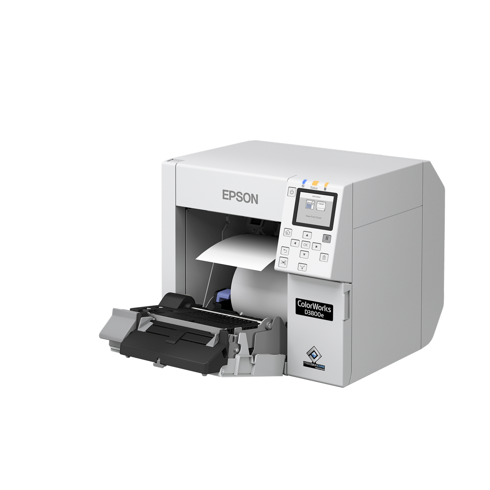
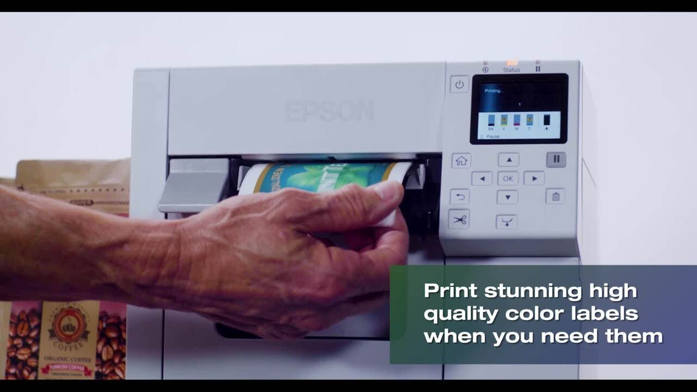
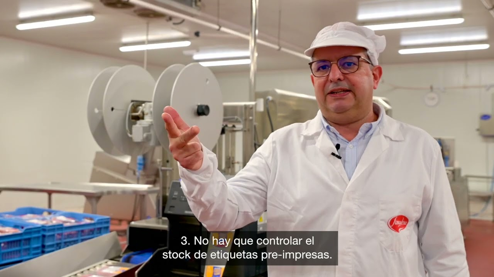

Epson amplia la seva gamma d’impressores d’etiquetes en color amb la **ColorWorks CW-D3800e**, una nova impressora d’etiquetes en color de sobretaula pensada per a negocis que treballen amb tiratges curts, moltes referències o necessitats de personalització freqüents.

La CW-D3800e està orientada especialment a comerç minorista, comerç electrònic, petits productors, farmàcies, parafarmàcies i altres entorns on cal produir etiquetes professionals sense assumir grans volums ni mantenir un estoc extens d’etiquetes preimpreses.

## Epson ColorWorks D3800e: característiques principals

La nova impressora combina un disseny compacte amb un sistema de tinta colorant CMYK, especialment indicat per aconseguir **colors vius i negres intensos sobre materials brillants**. Pot imprimir des d’una sola etiqueta fins a tiratges curts i permet adaptar cada producció a la demanda real.

Entre les seves característiques principals destaquen:

- resolució de fins a **600 × 1.200 ppp**;
- velocitat màxima de fins a **100 mm/s** a 300 × 600 ppp;
- amplada d’impressió de fins a **108 mm**;
- cartutxos de tinta individuals CMYK;
- tallador automàtic incorporat;
- connexió USB de sèrie i Wi-Fi opcional mitjançant adaptador;
- controladors per a Windows, macOS i Linux;
- compatibilitat amb SAP, ESC/Label i emulació ZPL II;
- integració amb BarTender, Loftware Cloud i Teklynx CODESOFT;
- eines de manteniment, supervisió i configuració remotes.

Epson també hi incorpora detecció automàtica de punts d’impressió absents i ajust de la qualitat, una ajuda pràctica per simplificar el manteniment quotidià.

Pots consultar la [fitxa oficial de l’Epson ColorWorks CW-D3800e](https://www.epson.es/es_ES/productos/impresoras/impresora-de-etiquetas-en-color/impresora-de-etiquetas-de-tinta-colorante-colorworks-d3800e/p/57465).

## Per què imprimir etiquetes en color sota demanda?

Una impressora d’etiquetes en color no serveix només per millorar l’estètica. Ben integrada en el procés, permet convertir una etiqueta en una peça variable que combina marca, informació operativa, codis de barres, dades de traçabilitat i elements promocionals.

### Menys dependència d’etiquetes preimpreses

En lloc d’encarregar grans quantitats de cada disseny, l’empresa pot imprimir quan ho necessita. Això pot reduir l’estoc de referències preimpreses, les etiquetes obsoletes i les pèrdues provocades per canvis de disseny, idioma, ingredients, campanya o normativa.

### Més flexibilitat per a tiratges curts

La impressió digital facilita la producció de sèries petites, edicions estacionals, promocions, lots de prova o etiquetes personalitzades. També permet reaccionar amb més rapidesa davant canvis comercials o operatius.

### Més impacte visual i millor identificació

El color ajuda a reforçar la marca, diferenciar variants i destacar informació rellevant. En entorns logístics o sanitaris també pot contribuir a reconèixer visualment famílies de producte, prioritats o advertiments, sempre com a suport d’una identificació correcta i no com a substitut dels codis o textos obligatoris.

### Informació variable en una sola operació

Textos, logotips, imatges, numeracions, dates, lots, codis de barres i codis 2D es poden combinar en una mateixa impressió. Això evita haver de sobreimprimir una etiqueta prèviament produïda i simplifica determinats fluxos de treball.

## Una solució pensada per a materials brillants i tiratges curts

La CW-D3800e utilitza tinta colorant i Epson la posiciona especialment per a etiquetes sobre papers brillants. Aquesta combinació és adequada quan es prioritzen l’amplitud cromàtica, els colors intensos i una presentació atractiva del producte.

No totes les aplicacions, però, exigeixen el mateix. Si l’etiqueta estarà exposada a humitat, productes químics, fricció intensa, temperatures extremes o exterior, cal validar conjuntament **impressora, tinta, adhesiu i material**. En aquests casos pot ser més apropiat estudiar altres equips ColorWorks amb tinta pigmentada o una solució industrial específica.

## Vídeos: l’etiquetatge en color en funcionament

**Vídeo oficial d’Epson:** una visió ràpida de com la impressió en color sota demanda ajuda a produir etiquetes de producte amb més flexibilitat i menys dependència d’estoc preimprès.

**Cas real d’Epson Espanya:** Famadesa explica la incorporació de ColorWorks a la gestió de l’etiquetatge en color dels seus productes.

## Preguntes freqüents sobre l’Epson ColorWorks D3800e

### Per a quins negocis està pensada?

La D3800e encaixa especialment en comerç minorista i electrònic, petits productors, farmàcies, parafarmàcies i empreses que necessiten etiquetes de producte atractives en quantitats petites o variables.

### Quin tipus d’etiquetes pot imprimir?

Admet suports en bobina o paper continu d’entre 25 i 108 mm d’amplada. La seva tinta colorant està optimitzada per obtenir una reproducció cromàtica intensa en determinats papers brillants.

### Pot substituir sempre una impressora amb tinta pigmentada?

No necessàriament. Si les etiquetes necessiten una resistència elevada a l’aigua, els productes químics, la fricció o l’exposició exterior, convé fer proves d’aplicació i comparar-la amb models de tinta pigmentada.

## Abans de triar una impressora d’etiquetes en color

La decisió no s’ha de basar només en la resolució o la velocitat. Cal analitzar el nombre de referències, el volum diari, la mida de les etiquetes, el material, la durabilitat necessària, el sistema de tall o dispensació i la integració amb el programari de gestió i etiquetatge.

A S-IE podem ajudar-te a valorar si la **Epson ColorWorks CW-D3800e** encaixa amb el teu procés, preparar proves amb les teves etiquetes i definir una solució completa d’impressió, consumibles i integració. Descobreix les nostres [solucions d’impressió d’etiquetes en color](/ca/impressores-termiques/) o [parlem del teu projecte](/contacte).
