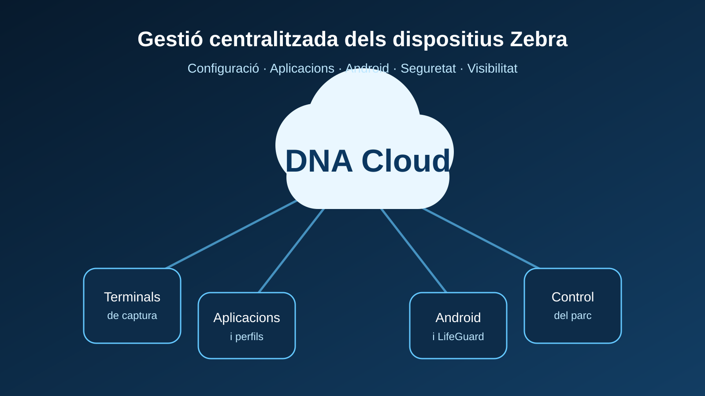

Cuando una empresa despliega terminales de captura de datos, el reto no termina al escoger el dispositivo adecuado. A medida que el parque crece aparece una necesidad igual de importante: **mantener todos los equipos configurados, actualizados, seguros y preparados para trabajar**.

Hacerlo terminal por terminal es lento, difícil de auditar y acaba generando diferencias entre dispositivos. Por eso la gestión centralizada mediante MDM o UEM se ha convertido en una parte esencial de los proyectos de movilidad profesional.

En el ecosistema Zebra, **Zebra DNA Cloud** ofrece una propuesta especialmente interesante: una consola en la nube pensada específicamente para administrar dispositivos y aplicaciones Zebra, aprovechando las capacidades de **Mobility Extensions (MX)**.

## De gestionar terminales a gestionar una infraestructura

Un terminal utilizado en logística, producción, retail o servicios de campo puede trabajar varios turnos, conectarse a redes corporativas, ejecutar aplicaciones críticas y capturar miles de datos cada día.

Una configuración incorrecta, una aplicación desactualizada o una actualización de Android no controlada pueden afectar directamente a la operativa.

El objetivo no es solo tener dispositivos funcionando, sino poder responder de forma ordenada a cuestiones como qué terminales tenemos, qué versión de Android utilizan, qué configuración necesita cada grupo, cómo desplegar cambios y cómo preparar rápidamente un equipo de sustitución.

## Zebra DNA Cloud: una consola central para los dispositivos Zebra

**Zebra DNA Cloud (ZDNA)** es la plataforma administrativa en la nube de Zebra para gestionar y configurar dispositivos y aplicaciones Zebra.

La consola proporciona una visión centralizada del parque y permite trabajar sobre dispositivos, configuraciones, aplicaciones, actualizaciones Android y licencias desde un mismo entorno.

El dashboard ofrece una visión general de aspectos como el estado de dispositivos y baterías, la asignación de licencias y la disponibilidad de actualizaciones Android.

Esto convierte información que a menudo está dispersa en una **visión operativa del parque de movilidad**.

## Configurar una vez y desplegar de forma homogénea

Una de las claves de una buena gestión es la estandarización.

DNA Cloud permite trabajar con **perfiles de configuración** y grupos de dispositivos. Así puede definirse una configuración y aplicarla de forma coherente a los equipos que comparten una misma función.

Por ejemplo, los terminales de un almacén pueden necesitar una configuración Wi-Fi, determinadas aplicaciones, preferencias de pantalla y una política concreta de actualización.

> Dos terminales destinados a realizar el mismo trabajo deberían comportarse de la misma forma.

## Incorporar nuevos terminales de forma ordenada

DNA Cloud también incorpora herramientas para preparar nuevos dispositivos.

El proceso **New Device Setup** permite crear los parámetros mínimos para que el terminal disponga de conectividad, instale el cliente necesario y se incorpore al entorno de gestión. La configuración inicial puede aplicarse mediante un código de barras.

Esto simplifica los despliegues iniciales, las ampliaciones del parque y la sustitución de equipos averiados.

## Aplicaciones corporativas bajo control

El dispositivo es solo una parte del sistema. Las aplicaciones que ejecuta son igualmente importantes.

DNA Cloud incorpora funciones para administrar y desplegar aplicaciones Zebra y aplicaciones propias de la organización, integrando la gestión del software dentro de la misma estrategia de administración de los terminales.

## Actualizaciones Android y LifeGuard

Los terminales industriales suelen tener una vida útil superior a los dispositivos de consumo. Por ello conviene gestionar las actualizaciones Android como un proceso corporativo.

DNA Cloud integra la gestión de actualizaciones disponibles para dispositivos Zebra y se relaciona con los servicios **LifeGuard for Android**.

En entornos críticos resulta recomendable validar las actualizaciones en un grupo reducido, comprobar las aplicaciones de negocio y ampliar después el despliegue.

## Estado del dispositivo y salud de la batería

DNA Cloud muestra información del parque como la versión Android, la presencia del dispositivo, la última conexión y datos relacionados con la batería.

Esta visibilidad ayuda a evolucionar desde un modelo reactivo, esperando a que el usuario comunique un problema, hacia una gestión más ordenada y preventiva.

## DNA Cloud puede convivir con un MDM o EMM existente

Adoptar DNA Cloud **no obliga necesariamente a sustituir la plataforma corporativa existente**.

Zebra indica que DNA Cloud puede funcionar de manera independiente o junto con un EMM de terceros. También admite poblaciones mixtas, con dispositivos gestionados directamente por DNA Cloud y otros cuyo Device Owner es el EMM corporativo.

Mediante **Zebra OEMConfig powered by MX**, un EMM compatible puede acceder además a configuraciones avanzadas específicas de los terminales Zebra.

## DNA Cloud, StageNow y MDM: no son necesariamente alternativas

Las herramientas pueden cumplir funciones complementarias.

**StageNow** sigue siendo muy útil para preparar y configurar terminales Zebra. Un MDM/UEM corporativo puede gobernar distintas familias de dispositivos de toda la organización. Y **DNA Cloud aporta una capa especializada en el ecosistema Zebra**, con gestión, configuración, aplicaciones, actualizaciones y visibilidad del parque.

La arquitectura adecuada dependerá del número de terminales, de la infraestructura IT existente y del nivel de control necesario.

## ¿Cuándo tiene sentido plantear Zebra DNA Cloud?

DNA Cloud resulta especialmente interesante cuando una empresa quiere:

- centralizar la visibilidad de sus terminales Zebra;
- reducir configuraciones manuales;
- desplegar perfiles homogéneos;
- administrar aplicaciones;
- controlar versiones y actualizaciones Android;
- simplificar el alta y sustitución de dispositivos;
- aprovechar las capacidades específicas de Zebra MX;
- complementar una plataforma MDM/EMM existente.

No es necesario esperar a tener cientos de terminales. Establecer una metodología cuando el parque todavía es reducido evita que la complejidad crezca de forma desordenada.

## S-IE: el dispositivo y su gestión forman parte del mismo proyecto

En S-IE consideramos que seleccionar un [terminal profesional](/es/hardware) es solo una parte del proyecto.

La configuración, el despliegue, las aplicaciones, las actualizaciones, la seguridad y el soporte posterior determinan en gran medida el rendimiento real de la solución durante toda su vida útil.

Podemos ayudar a analizar si **Zebra DNA Cloud**, un MDM corporativo o una arquitectura combinada es la opción adecuada para tu parque de terminales Zebra y definir una política coherente de despliegue y mantenimiento.

Si actualmente gestionas los terminales de forma manual o estás preparando un nuevo despliegue, [contacta con S-IE](/es/contacto) y revisaremos cómo estructurar su gestión.
