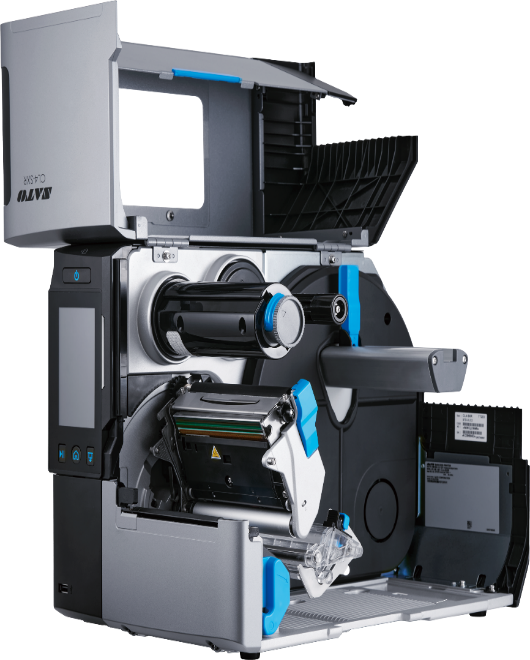
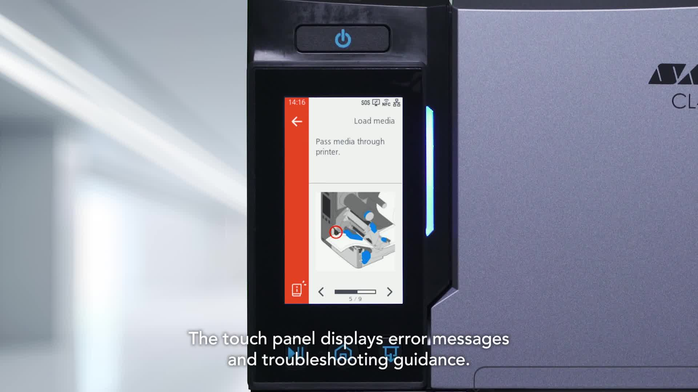
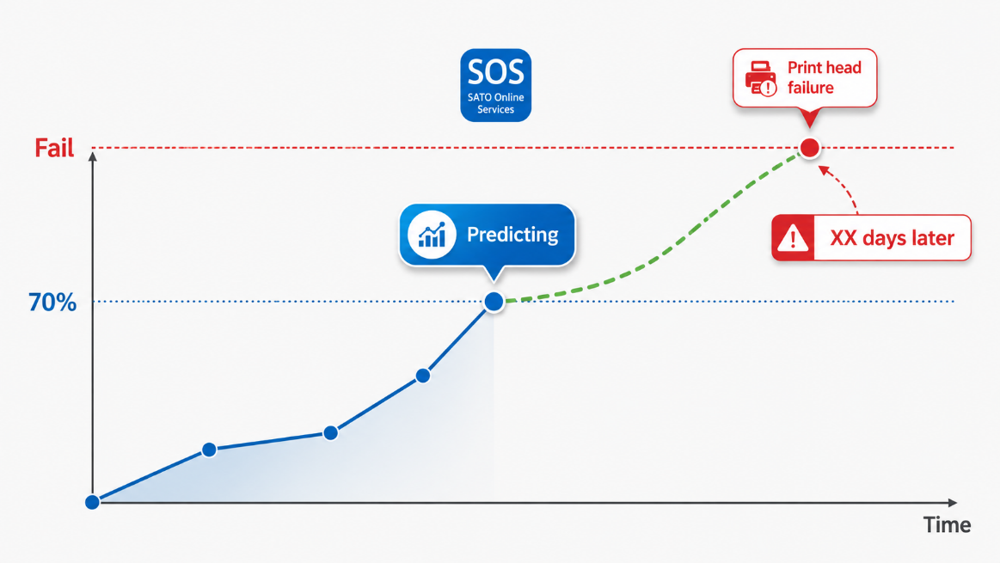

SATO renueva su gama industrial con las **CL4-SXR y CL6-SXR**, dos modelos de
4 y 6 pulgadas concebidos para procesos en los que una etiqueta mal impresa o
una parada de la impresora puede frenar toda la operativa.

La nueva serie no se limita a incrementar la velocidad. SATO ha rediseñado el
mecanismo de impresión y el paso de los consumibles, ha incorporado funciones
para prevenir errores y ha reforzado la gestión remota. El resultado es una
plataforma que busca reducir intervenciones, mantener una calidad estable y
facilitar el trabajo diario del operario.

Repasamos los elementos que realmente diferencian esta nueva generación.

## Hasta 18 ips sin renunciar a la precisión

La CL4-SXR de 203 dpi alcanza hasta **18 pulgadas por segundo**, equivalentes a
457,2 mm/s. Es la velocidad de impresión más alta conseguida por SATO hasta
ahora y responde especialmente bien en entornos con grandes volúmenes, como
expediciones, centros logísticos y líneas de producción.

La velocidad solo resulta útil si la etiqueta mantiene su posición. El modo de
alta precisión de la serie ofrece una exactitud de **±0,3 mm** en las
condiciones de prueba indicadas por el fabricante. Esta estabilidad es
relevante en etiquetas pequeñas, aplicaciones automáticas o diseños con poco
margen entre el contenido y el borde.

La gama permite adaptar la resolución a cada uso:

- **CL4-SXR:** 203, 305 o 609 dpi;
- **CL6-SXR:** 203 o 305 dpi.

Los 609 dpi de la CL4-SXR abren la puerta a microtextos, códigos compactos y
etiquetas de alta densidad para sectores como la industria farmacéutica, la
electrónica o la identificación de componentes.

## Un nuevo control del material para imprimir con más estabilidad

Buena parte de las mejoras se encuentran en el interior. SATO ha revisado el
soporte de la bobina, el mecanismo amortiguador y el recorrido del ribbon para
reducir vibraciones, desviaciones y arrugas.

El nuevo sensor GAP2 complementa la detección del material y ayuda a mejorar la
precisión. El cabezal térmico también se ha desarrollado para soportar las
nuevas funciones de control de temperatura y detección preventiva.

Otro detalle práctico es la compatibilidad con bobinas y ribbons enrollados
hacia dentro o hacia fuera sin tener que modificar la configuración. La serie
admite bobinas de hasta **220 mm de diámetro** y ribbons de hasta **600 metros**,
lo que reduce la frecuencia de los cambios en trabajos intensivos.

## La impresora ayuda a evitar el error antes de imprimir

La pantalla táctil resistiva en color de 4,3 pulgadas incorpora una función de
previsualización. El operario puede comprobar el diseño y los datos de la
etiqueta antes de confirmar la impresión, una barrera adicional contra
etiquetas incorrectas y repeticiones innecesarias.

La interfaz se puede personalizar con accesos, mensajes e información propia de
cada centro de trabajo. Además, el altavoz integrado permite añadir avisos
sonoros o instrucciones de voz.

Cuando aparece una incidencia, la propia pantalla puede mostrar vídeos e
instrucciones paso a paso. Esta asistencia reduce la dependencia de manuales y
facilita que el operario resuelva tareas habituales, como cargar el ribbon o
recuperarse de un error.

## Mantenimiento predictivo para actuar antes de la parada

Una de las innovaciones más significativas es la evolución de **SATO Online
Services (SOS)**. El sistema utiliza datos de funcionamiento para detectar
signos de desgaste y estimar cuándo conviene sustituir el cabezal térmico.

El objetivo consiste en convertir una avería imprevista en una intervención
planificada. En una línea donde no se puede producir o expedir sin etiqueta,
esta previsión puede marcar una diferencia importante en la disponibilidad.

La máquina también facilita el mantenimiento local. El cabezal y el rodillo de
arrastre se pueden sustituir sin herramientas, y la tapa de apertura amplia
deja accesibles los componentes que deben limpiarse o renovarse.

La función de escritorio remoto permite consultar y operar la impresora desde
otra ubicación. Resulta especialmente útil en líneas automatizadas, armarios de
protección o puntos de impresión de difícil acceso.

## AEP: flujos de impresión sin ordenador

La tecnología **SATO AEP (Application Enabled Printing)** permite ejecutar
aplicaciones directamente en la impresora. Se pueden conectar escáneres,
teclados, básculas y otros periféricos para que el operario introduzca o capture
los datos e imprima la etiqueta correcta sin depender de un PC.

AEP también puede consultar bases de datos o servicios de red. Esto permite
construir flujos guiados y específicos para cada operación, con menos pasos
manuales y menos posibilidades de escoger una plantilla incorrecta.

SATO App Storage facilita la distribución de estas aplicaciones entre una
flota de impresoras. La configuración se puede clonar de forma completa o
parcial para acelerar una sustitución o desplegar el mismo comportamiento en
varias líneas y centros.

## Menos etiquetas descartadas desde el arranque

La función **Label Waste Prevention** detecta el borde inicial del material al
cargar una bobina nueva y ajusta la posición para empezar a imprimir desde la
primera etiqueta.

Esta mejora evita las etiquetas que habitualmente se pierden durante la
configuración inicial. El beneficio económico aumenta cuando se trabaja con
consumibles especiales o etiquetas RFID, que tienen un coste unitario mayor.

La impresora también rebobina automáticamente el ribbon al abrir el cabezal. El
diseño permite recoger el ribbon utilizado sin un núcleo de cartón, lo que
simplifica el cambio y reduce residuos.

SATO indica que aproximadamente el **34% del peso de los componentes de resina**
procede de resina reciclada. Este material se utiliza en la carcasa y en otras
piezas sin alterar la robustez industrial prevista para el equipo.

## RFID, verificación y opciones para adaptar la máquina

La serie se puede configurar con kits RFID UHF y, en el caso de la CL4-SXR,
también HF. Esto permite imprimir y codificar identificadores RFID dentro del
mismo proceso.

Entre las opciones también existen cortadores, dispensador, rebobinador externo
y un sistema de verificación de códigos 1D y 2D. La CL4-SXR incorpora, además,
opciones de corte rotativo y trabajo con material linerless.

La conectividad incluye Gigabit Ethernet y, opcionalmente, Wi-Fi 6E tribanda y
Bluetooth 5.2. Las múltiples emulaciones de lenguajes de impresión facilitan la
sustitución de equipos existentes sin tener que replantear todas las
aplicaciones desde el primer día.

## Dos formatos para necesidades distintas

| Modelo | Anchura máxima de impresión | Resoluciones | Velocidad máxima |
| --- | ---: | --- | ---: |
| CL4-SXR | 104 mm | 203, 305 o 609 dpi | 18 ips a 203 dpi |
| CL6-SXR | hasta 167,5 mm según configuración | 203 o 305 dpi | 14 ips |

La CL4-SXR encaja en etiquetado de producto, fabricación, farmacia y logística
general. La CL6-SXR amplía el formato para etiquetas logísticas, palés y
aplicaciones que necesitan más superficie de impresión.

## Una evolución orientada a la continuidad operativa

La CL-SXR combina mejoras visibles, como la velocidad o la pantalla, con
cambios menos evidentes pero decisivos: mejor control del material, predicción
del desgaste, recuperación guiada, clonación de configuraciones y reducción del
residuo inicial.

La **CL4-SXR ha recibido el Red Dot Award: Product Design 2026**, un
reconocimiento al nuevo diseño y a su orientación hacia el uso industrial.

Como [partner oficial de SATO](/es/partners/sato), en S-IE podemos analizar el
material, el volumen, la resolución, las integraciones y las opciones que
necesita cada aplicación antes de plantear una migración.

**¿Quieres valorar si la nueva SATO CL4-SXR o CL6-SXR encaja en tu operativa?**
[Hablemos de tu proyecto](/es/contacto) y prepararemos una configuración
adaptada a tu proceso.

_Fuentes: documentación técnica, presentación comercial y vídeo oficial de
lanzamiento facilitados por SATO. Información de producto actualizada en agosto
de 2025; las especificaciones y la disponibilidad de opciones pueden cambiar
según el mercado. Consulta también el [lanzamiento oficial de la
CL4/6-SXR](https://www.sato-global.com/news/release/2025/20250901-2/)._
